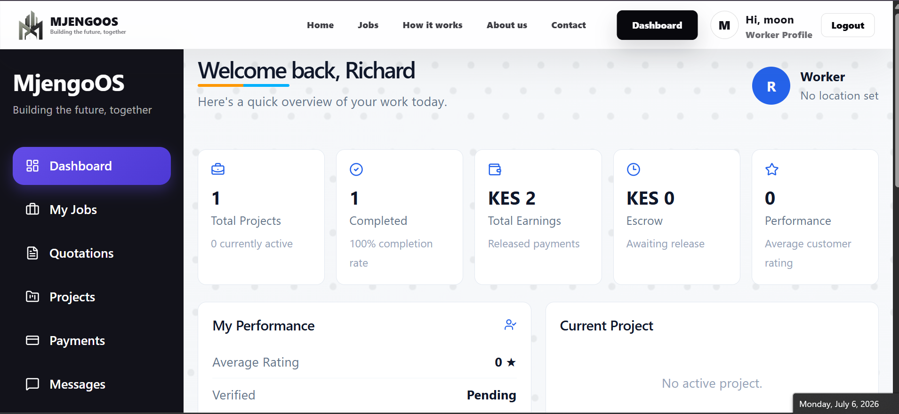
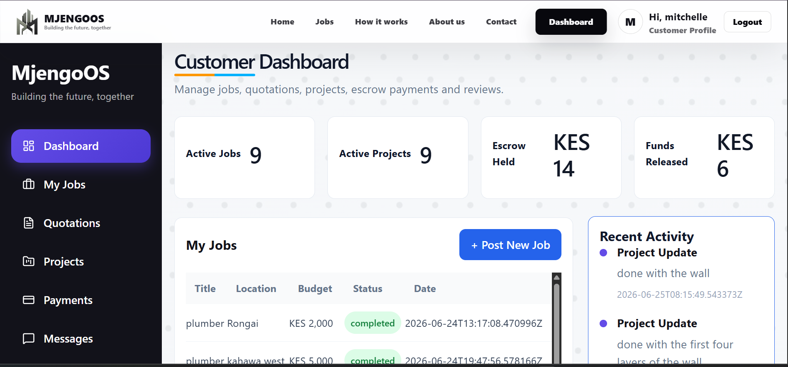

# MjengoOS 

## Overview

MjengoOS is a full-stack web application developed to simplify the process of connecting customers with skilled construction workers. The platform provides a secure environment where customers can post construction jobs, receive quotations from workers, hire professionals, monitor project progress, manage escrow payments, communicate through messaging, and review completed work.

The system was developed with a focus on solving common challenges in the construction industry such as trust, payment security, project monitoring, and efficient communication.

---

# Features

## Customer Features

* User registration and authentication
* Customer profile management
* Post construction jobs
* View available quotations from workers
* Accept or reject quotations
* Hire workers
* Secure escrow payments through M-Pesa
* Track project progress
* View worker updates and uploaded images
* Release payments after project completion
* Rate and review workers
* Send and receive messages

---

## Worker Features

* Worker registration and professional profile
* Browse available jobs
* Submit quotations for jobs
* Manage quotations
* View assigned projects
* Upload project progress updates
* Mark projects as completed
* Track payments
* View earnings
* Receive customer reviews
* Dashboard with performance statistics
* Edit professional profile
* Messaging system

---

# System Modules

* Authentication
* Customer Dashboard
* Worker Dashboard
* Job Management
* Quotation Management
* Project Management
* Escrow Payment System
* Messaging System
* Review & Rating System
* User Profile Management
* Admin Panel

---

# Technologies Used

## Frontend

* React.js
* React Router
* CSS3
* Lucide React Icons

## Backend

* Django
* Django REST Framework

## Database

* PostgreSQL

## Payment Integration

* Safaricom M-Pesa Daraja API

## Authentication

* JWT Authentication

## Deployment

* Render for backend.
* Vercel for frontend.

---

# Dashboard Features

### Customer Dashboard

* Dashboard Overview
* Jobs
* Quotations
* Projects
* Payments
* Messages
* Reviews
* Profile

### Worker Dashboard

* Dashboard Overview
* Browse Jobs
* My Quotations
* My Projects
* Payments
* Reviews
* Messages
* Profile

---

# Project Workflow

1. Customer posts a construction job.
2. Workers browse available jobs.
3. Workers submit quotations.
4. Customer reviews quotations.
5. Customer accepts one quotation.
6. Customer creates a project.
7. Customer deposits funds into escrow.
8. Worker begins the project.
9. Worker uploads progress updates.
10. Customer monitors project progress.
11. Worker marks the project as completed.
12. Customer confirms completion.
13. Escrow payment is released.
14. Customer leaves a review and rating.

---

# Security Features

* JWT Authentication
* Protected Routes
* Escrow Payment Protection
* Role-Based Access Control
* Secure REST API

---

# Future Improvements

* AI-powered worker recommendations
* Multi-language support
* Mobile application

---

# Installation

## Clone the repository

```bash
git clone https://github.com/josephgakono/mjengoos-frontend.git
```

## Frontend

```bash
npm install
npm run dev
```

## Backend

```bash
pip install -r requirements.txt
python manage.py migrate
python manage.py runserver
```

---

# Screens

* Authentication
* Customer Dashboard
* Worker Dashboard
* Job Listings
* Quotations
* Projects
* Payments
* Reviews
* Messaging
* Profile Management

---
# Links
[Frontend Github Repository](https://github.com/josephgakono/MjengoOS-Frontend)
<br>
[Backend Github Repository](https://github.com/josephgakono/MjengoOS)
<br>
[Vercel link](https://mjengooswebapp.vercel.app/)

# Project Goals

The primary goal of MjengoOS is to improve transparency, accountability, and trust between customers and construction workers by digitizing the entire hiring and project management process while ensuring secure payments through an escrow mechanism.

---
# Screenshots



# Author

**Joseph Gakono**
